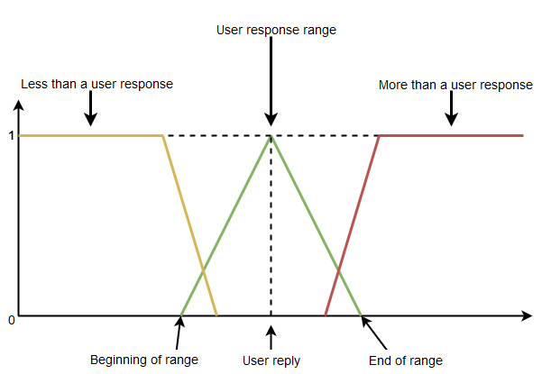
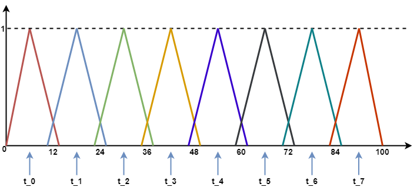
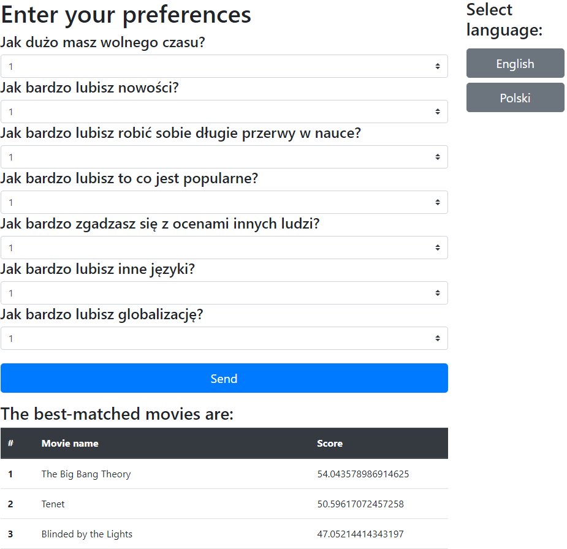

# Table of contents
* [Fuzzy logic](#fuzzy-logic)
* [Configuration](#configuration)
* [Example](#example)
* [Built with](#built-with)

## Fuzzy logic

### Question rating:


### Movies rating:


## Configuration
* Set [API key](http://www.omdbapi.com/apikey.aspx) (```omdb.api.key```) in:
    
    ```./src/main/resources/config/application.properties```
    
* Set path to the fuzzy logic controller (```fuzzy.logic.controller.path```) in:
    
    ```./src/main/resources/config/application.properties```
    
* Personalize your questions in:
    
    ```./src/main/resources/import.sql```
    
    Parameters:
    
    | Name | Meaning |
    | --- | --- |
    | description | Description of the question. |
    | base_movie_variable | Described value from IMDB (one of: RUN_TIME, RELEASED, TOTAL_SEASONS, IMDB_VOTES, METASCORE, QUANTITY_LANGUAGES, QUANTITY_COUNTRIES). |
    | variable_name | Name in the fuzzy logic controller. |
    | start_variable | Beginning of range for variable. |
    | end_variable | End of range for variable. |
    | good_value_range | User response range (+/- good_value_range). |


* Personalize movie list:
    
    ```./src/main/resources/import.sql```
    
### Question rating:
    
    
## Built with

* [JDK 11](https://www.oracle.com/technetwork/java/index.html)

* [Spring Boot - 2.3.0.RELEASE](https://spring.io/projects/spring-boot) 
    * [Log4j](https://logging.apache.org/log4j/2.x/)
    * [HSQLDB](http://hsqldb.org/)

* [jFuzzyLogic](http://jfuzzylogic.sourceforge.net/html/index.html) 

* [Swagger2](https://swagger.io/)
